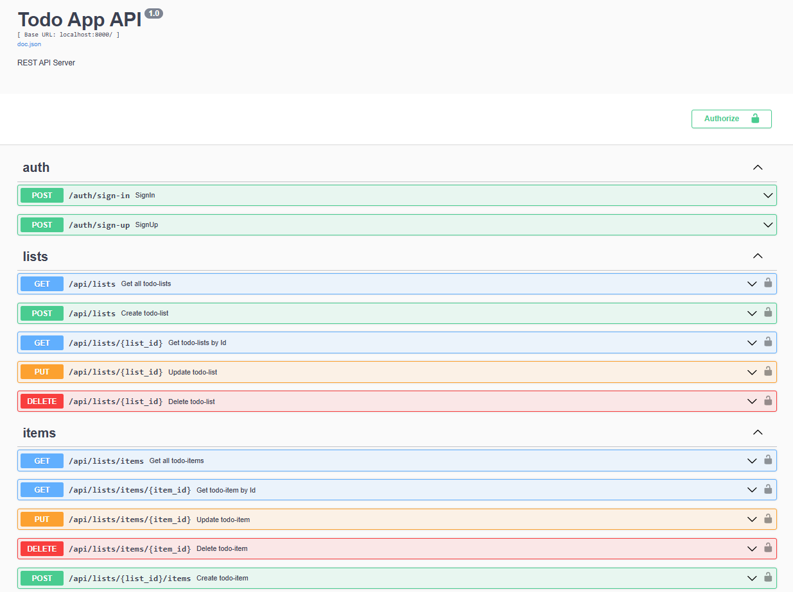

# REST API сервер

- Разработка веб-приложения на Go, следуя дизайну REST API.
- Сервер написан с использование [go-chi/chi](https://github.com/go-chi/chi)
- Использовался подход Чистой Архитектуры в построении структуры приложения
- Структура репозитория по стандарту [golang-standards/project-layout](https://github.com/golang-standards/project-layout)
- Работа с БД PostgreSQL - [jackc/pgx](https://github.com/jackc/pgx)
- Сборка и запуск всего приложения с помощью Docker
- Парсинг переменных окружения в структуру - [caarlos0/env](https://github.com/caarlos0/env) 
- Аутентификация осуществляется с помощью JWT
- Реализован собственный парсер ```tools/bindchi``` URL параметров, тела запроса и контекста в структуру
- Валидация структур по структурным тегам - [go-playground/validator](https://github.com/go-playground/validator)
- Добавлен Swagger для наглядности - [swaggo/swag](https://github.com/swaggo/swag)

## Окно Swagger



## Запуск сервера #
* Клонирование репозитория
```console
git clone https://github.com/isOdin-l/REST-CRUD-golang
cd REST-CRUD-golang
```

* Сборка и запуск в docker контейнере
```console
docker-compose up --build
```
